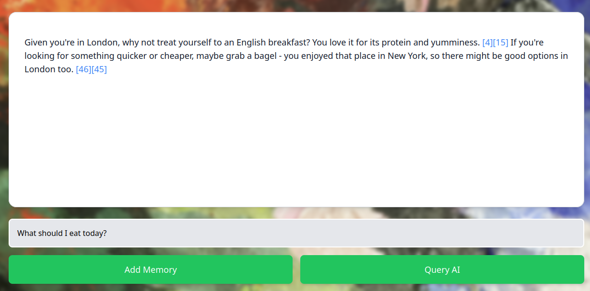
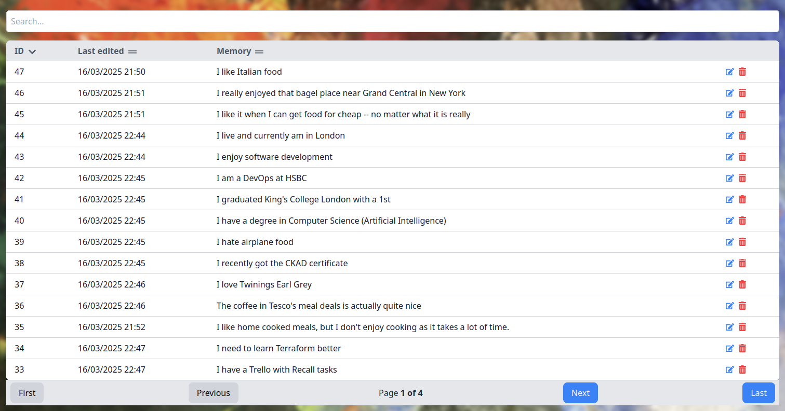
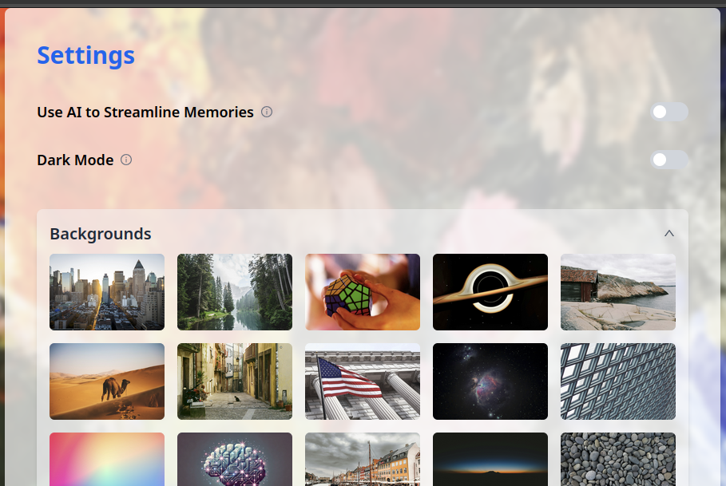

Welcome to my blog.

> "Make something you want to use yourself."

This is one of the wisest things I heard regarding personal projects. Just like most developers, all too often I started
a new project, worked on it for two weeks, and then dropped it once the novelty wore off.

I've been working on Recall for over 6 months and don't plan to stop. It's an AI-driven memory management app. 
Provided thoughts and memories over time, it builds a profile of you, learns to answer questions, and even gives 
you insights about yourself.

Call it a virtual companion, a tech-enabled diary or a personalised ChatGPT -- all of these would be accurate in a way.

It has been a treasure of an experience for me: taking the project all the way from its early POC days to (almost)
production-ready software. It's an amazing thing about software engineering that we can work on an app for months and
yet no two problems will be the same. My struggles in the app's early days were very different from the challenges I
face now. I anticipate that releasing the app will bring its new set of challenges, from observability to reliability
engineering.

Initially I focussed on adding features fast, enjoying the dopamine that rapid development brought me. But the brightest
candles burn out the fastest and, as I realised that, I understood that I need to add more structure to avoid technical
debt and not sabotage future development. 

I refactored the rapid-fire code and introduced GitHub Actions to uphold standards, through the use of testing 
coverage requirements, linting, vulnerability scanning and static analyses.
That, combined with a strong emphasis on maintainability and testability, has so far been successful at keeping the
codebase clean and logical.

I cannot express how much this project has taught me. Going from nothing to a large piece of software has
given me a new appreciation of forward-thinking and good software design from the get-go.

I've also used Recall as my guinea pig for new technologies and development methodologies,
and see tremendous potential in continuing that. After all, following a tutorial that walks me through a simple 
demo of a service will not make me ready to implement it into a complex application in production. 
A patchwork project like Recall is a great opportunity to bridge that gap and practice on something that's low stakes,
but may also emulate the challenges of being *the real deal*.

While I don't intend to get into the technical nitty-gritty in this post, I will go over the key components that make up Recall.

Recall's answer to "What should I eat today?"

## Key components

_TL;DR: Conversation box for saving memories & querying AI. Memorybank for viewing, editing and deleting memories. 
Has settings and full authentication and authorisation._

### Conversation box
This is the main interface for interacting with the AI and sits on Recall's index page. It's what you can see in 
the screenshot above. Currently, it's a simple text box with an output field and two buttons, 'Add Memory' and 
'Query AI'.

While simple, it's packed with features designed for convenience. The user can view the source memories 
(note the references in square brackets), undo actions and scroll through their inputs with up and down arrows like on 
a Linux terminal - all without leaving the page.

This interface reflects my original aim to innovate instead of following ChatGPT et al., but I now think interacting with LLMs through
a chat conversation is actually superior. Ideally the user would always get exactly what they need in one prompt, but this is unlikely
given the current capabilities of LLMs. Being able to keep questioning the AI hedges against mediocre 
output. 

As a result, I'm looking to turn this into a chat interface in a future iteration to improve user experience.

### Memorybank
The memorybank contains all the thoughts and memories that the user entered. The user can view, edit and delete their 
memories here. They all have unique IDs and the system is set up to support multiple users (each user with their own private
memorybank of course).

Memorybank page with sample memories

### Settings
The settings page contains all the customisables the user has access to. 

Memory streamlining allows for greater flexibility
when adding memories (for example, by dividing one long string into multiple memories). When it's enabled, users can add 
memories by writing a story. I will cover that in more depth in another post.

Settings are saved either in the browser's local storage or in DynamoDB depending on whether the setting should 
only apply to the machine, or to the whole user account.

Settings page

Memory streamlining is only available to authorised users (belonging to the 'premium' group), bringing me to the last 
key component I'll cover today.

### Authentication and authorisation

The project uses Amazon Cognito to handle authentication & authorisation. Users are issued tokens which are used
to authorise any action in the backend. Without being logged in, the user will not be able to use the application.

Tokens come with the user's groups, which state whether they are a premium user. Modifying a Cognito-issued token
would invalidate it, which would be detected by my app and prevent an attacker from accessing any data.

Security is tremendously important when handling sensitive data like user memories. Authentication is a part of my
security strategy, but I hope to go into a lot more depth about it in another post.

## Conclusion

In conclusion, Recall is my AI memory management passion project. Building the app brought me a deeper appreciation of
good software engineering practices and scalable architecture as I saw their benefits first-hand. I will delve 
deeper into its technical aspects and individual challenges I faced in future posts, but for now, this post serves as a 
high-level overview.