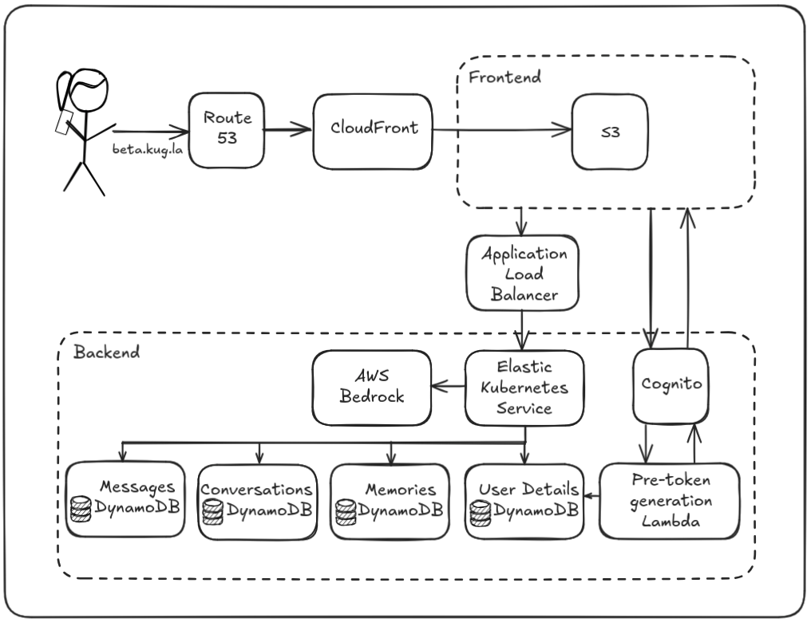
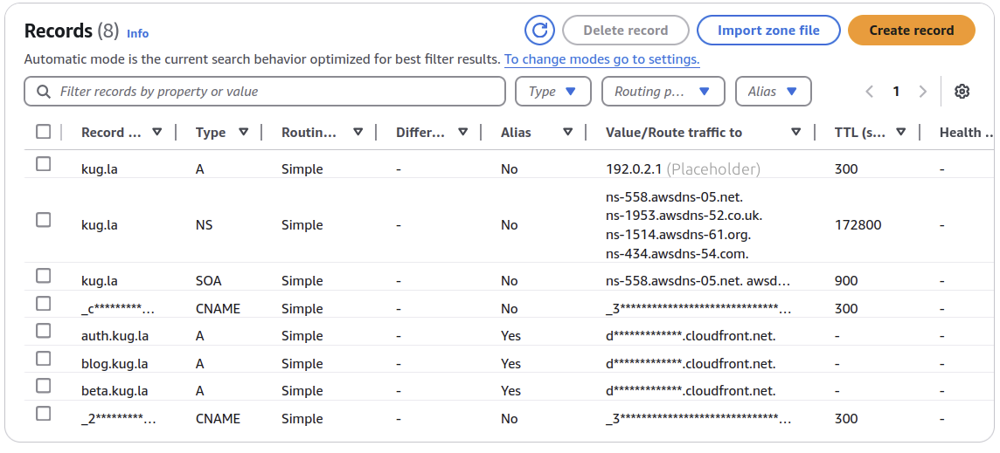
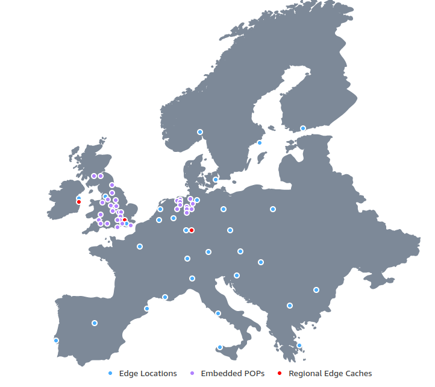
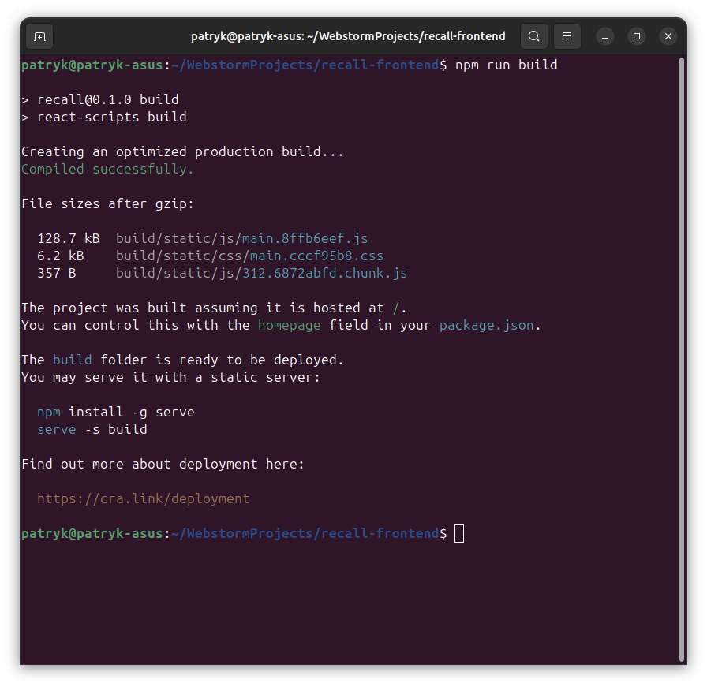
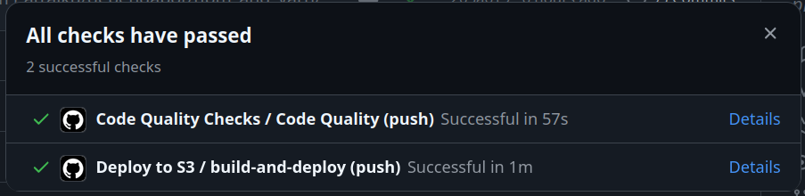
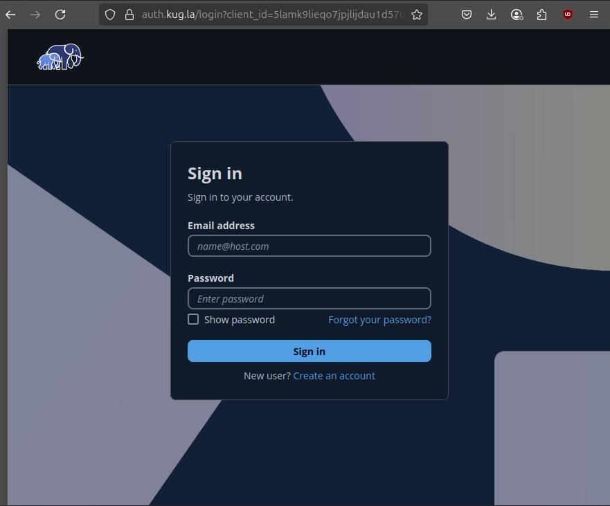
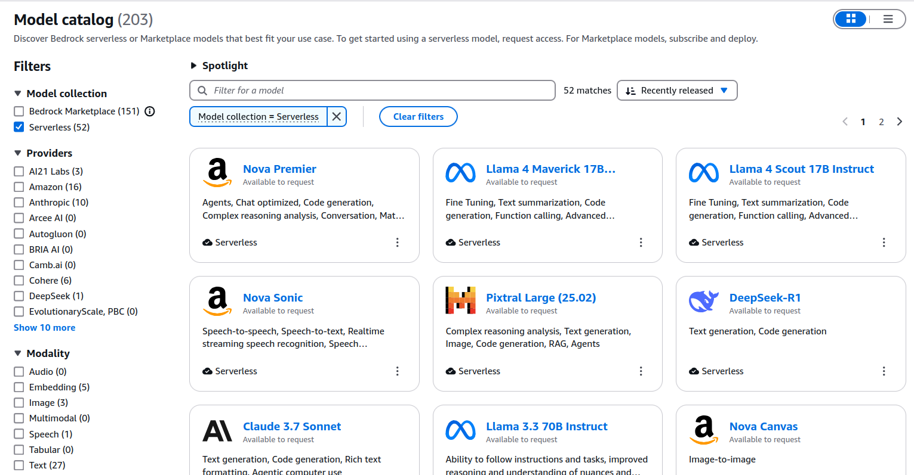

Welcome to my blog.

In this post, I'll dive into how Recall is deployed to the cloud and how each component serves the user.

Most of Recall's infrastructure is hosted on AWS: The front-end is deployed in S3 and served via CloudFront, memories are
stored in DynamoDB tables, Cognito (with the help of Lambda) forms the backbone of authentication. Route 53 manages my domain
and Bedrock powers LLM integration. From a cloud perspective, this is definitely an AWS project.

# Why AWS?

On the surface, AWS, Azure and GCP offer similar sets of features. Instead of S3, Azure has Blob Storage. Instead of
EKS, GCP has GKE _(which I'm actually quite jealous of)_. The fundamentals exist in all providers' ecosystems.

Where cloud providers attract developers is with their cutting-edge services. When I started Recall, AWS offered the simplest
way of interacting with all major LLM models. Google's Vertex AI might have had an edge in training models, but Bedrock 
offered me a way to interact with the latest Claude/GPT/Llama models in a simple, scalable, and infra-free way. The 
monthly price being based solely on tokens used also meant that my costs remained low and will scale linearly with users.
The serverless model also scales better during peak usage times, where users shouldn't notice any added latency 
or drop in availability.

Also, so far I've enjoyed Cognito. Cognito manages user pools, sign-ups (including SSO), 
logins, email confirmations, and even the layout of the sign-in page. It abstracts authentication to just token management, 
vastly simplifying what can be a complicated and error-prone procedure. As far as I know, GCP and Azure don't offer 
anything quite as comprehensive, so this is a big plus for AWS (although Cognito is far from perfect, [as discussed below](#cognito)).

Besides, my job at HSBC exposes me to GCP on a daily basis. I thought it'd be a fun and educational experience to
try working with something different - I won't improve as a DevOps if I only stay in my comfort zone.

# Architecture Overview

The diagram below shows an overview of the request flow of Recall. Let's go over what happens when a user visits Recall
and the different elements of its architecture.

### Route 53
When the user types in my domain, `beta.kug.la`[^1], the browser needs to find its IP address. Assuming it's not cached,
the browser will hand the query over to the recursive DNS resolver.

The resolver will first query a DNS root nameserver for the Name Server (NS) records of the Top Level Domain (TLD) - in 
this case `.la`. The root server responds with the NS records (and associated glue A records) for the `.la` TLD nameservers.

Next, the resolver queries one of those `.la` TLD nameservers for the NS records of `kug.la`. That TLD server
responds with the NS records (and glue) for the domain's authoritative nameservers, which for Recall are managed in Route 53.[^2]

Finally, Route 53 is queried for the IP address of the `beta.kug.la` domain. 

Route 53 holds an A record which links the domain name to the IP address of Recall's CloudFront distribution.[^3]

### CloudFront
CloudFront is AWS's Content Delivery Network (CDN). It caches files in edge locations around the globe to deliver them to the user faster.

Although users in London and Warsaw may access my website under the same `beta.kug.la` URL, CloudFront will return different IP addresses to them. 
Each user will be directed to an edge location closer to their home. This can significantly decrease website latency.

*CloudFront edge locations in Europe as of May 2025*

CloudFront also improves redundancy and availability as if one edge server goes down, AWS automatically reroutes requests.

While I'm currently only using core CloudFront in Recall, it comes with many features that will keep it attractive even as the application scales. Such as:
* Lambda@Edge: Execute Lambda scripts in all Edge locations (e.g. inject security headers if a certain condition is met).
* Geo-targeting: Serve different content to users in different regions (e.g. different privacy policies or language settings).
* Geo-blocking: Block users from certain regions.
* Web Application Firewall (WAF): Layer 7 protection directly at the edge; allows blocking IPs, bots, SQL injections, XSS, and requiring CAPTCHA.

CloudFront is used to serve static files from my S3 bucket.

## Frontend
### S3
S3 is "_an object storage service offering industry-leading scalability, data availability, security, and performance_".
In the case of Recall's frontend, it's used to host the static files that are served by CloudFront.

Theoretically, as with any React.js application, Recall's frontend can be built by running `npm run build`. This will produce a `build/` folder with all the website's
static assets. The folder can then be uploaded to S3, which has a bucket policy configured to allow CloudFront to serve its files.

However, doing this manually is not desirable. While it doesn't take extremely long, it's a classic example of **toil**. It's manual, repetitive, and error-prone if
done by hand. It also creates a risk of the code on GitHub being decoupled from the code served to users ("_Did I upload the files to S3 after the update?_").

#### CI/CD
For Recall, the whole process is automated with GitHub Actions.

The simple CI/CD I created for Recall's frontend can:
1. **Check code quality**: ESLint and Prettier are run in each PR. ESLint aims to catch bugs, bad practices, and anti-patterns. Prettier enforces consistent code formatting.
2. **Run tests**: Run all tests and enforce high code coverage.
3. **Deny merging bad code**: If tests don't pass, code coverage isn't high enough, or code quality is substandard, merging is blocked until issues are resolved.
4. **Deploy to S3**: Good code that is merged into main automatically gets deployed to S3. If bad code is merged into main directly (disabled in repo settings) and quality checks fail, the code will not be deployed.

This solves the aforementioned problems of manual deployments.

## Backend
### Cognito
Given how Recall stores sensitive information (memories), I could not afford to set up authentication wrong. A managed service 
like Cognito taking care of user management meant that I focus on other parts of the program while simultaneously learning 
authentication in more depth myself. 

Cognito has an attractive UI and manages the whole signing up and logging in experience. All I need to do is manage
tokens, which is comparatively easy. Cognito also has the advantage of being cheap compared to its competitors such as Auth0.
The free tier covers the first 10000 active users and the 'Lite' authentication features.

*Cognito's managed login UI*

Unfortunately, Cognito is far from perfect.[^4] It's not multi-region, meaning that users far away from the user pool will
always face additional latency. The hosted UI is inflexible and only allows minimum configuration (it's possible to set
the logo in the top left, but it's not possible to change any of the strings on the page). I also read that changes to
required fields (such as whether the user needs to enter a phone number or their name) require a new user pool to be created,
which would mean migrating all the credentials to it.

The inflexibility can be partly mitigated by using Lambda functions. For example, I use Lambda to retrieve some additional details about the user
(such as their premium status) from the User Details database. The general sentiment I've observed online is that the less workload
is managed directly by Cognito, the better.

It is a sufficient solution for Recall for now, and has not caused me much trouble, but migrating to solutions such as 
Auth0 might be better as the application grows and demands higher customisation.

### Elastic Kubernetes Service (EKS)

The backend of Recall is written in Go, containerised with Docker, and deployed with Kubernetes. EKS manages Recall's underlying 
Kubernetes cluster.

EKS offers a managed control plane which is deployed across multiple AZs. The EKS Auto Mode feature automates
the provisioning and operation of compute, storage and networking resources. This means that I can deploy workloads
without needing to manually manage node groups or infrastructure components.

EKS allows me to boil deployment down to (almost) just Kubernetes, with the required EC2 resources made behind the scenes
by Auto Mode. This means I get the benefits of Kubernetes (such as autoscaling, portability, and advanced scheduling), but
the setup isn't much harder than of ECS.[^5]

Route 53 will be added in front of the ALB in the future to make sure that the API URL is uniform and recognisable.
I'm considering using a tool like [external-dns](https://github.com/kubernetes-sigs/external-dns) to automate the process
of creating DNS records.[^6]

I will go into more depth about Docker, Kubernetes and Recall on EKS in a future article dedicated to this topic.

### DynamoDB

DynamoDB is Amazon's serverless, NoSQL, fully managed database service.

Apart from the generous Free Tier capable of handling up to 200M requests per month, DynamoDB also offers [5 9s availability](https://www.splunk.com/en_us/blog/learn/five-nines-availability.html)
and single-digit millisecond performance at any scale. For data that is accessed mostly by primary key (e.g. querying for memoryID 
to retrieve the memory string), DynamoDB is a very efficient solution.

All of Recall's databases are currently set up using DynamoDB. It's fast, reliable, and the free tier scales superbly.

### AWS Bedrock

We reach the component responsible for interactions with LLMs.

_Bedrock offers a wide variety of models_

AWS Bedrock allows Recall to interact with a wide variety of models in a serverless fashion, reducing the costs
of having infrastructure constantly running. Bedrock handles LLM guardrails (safeguards preventing
LLMs from acting in undesirable ways) and restricts data residency to the chosen AWS region (which may be necessary
for regulatory reasons, to comply with legislation such as GDPR and the EU AI Act).

#### DeepSeek-R1 Pricing Comparison

| Platform                         | Input Cost (per 1M tokens) | Output Cost (per 1M tokens) |
|----------------------------------|----------------------------|-----------------------------|
| **Amazon Bedrock**               | $1.35                      | $5.40                       |       
| **DeepSeek Official API**        | $0.55                      | $2.19                       |       
| **Fireworks AI (Basic Tier)**    | $0.55                      | $2.19                       |       
| **Fireworks AI (Fast Tier)**     | $3.00                      | $8.00                       |       
| **Together AI**                  | $3.00                      | $7.00                       |       

---

While overall Bedrock is good, it is far from being the objective "#1" choice.
As the table above shows, Bedrock is slightly more pricey than alternatives like [Fireworks AI](https://fireworks.ai/) or the official
DeepSeek API (though the latter caries high privacy concerns as its servers are hosted in China). Bedrock hasn't always been the 
first to bring models into its catalog either, with DeepSeek-R1 only coming out in serverless form on [10 March 2025](https://aws.amazon.com/blogs/aws/deepseek-r1-now-available-as-a-fully-managed-serverless-model-in-amazon-bedrock/), 
nearly 2 months after the model first came out. 

But with all its features, it is very much a production- and enterprise-ready LLM solution, and having
costs included and broken down under AWS's Billing and Cost Management service offers extra convenience to AWS
projects like Recall.

## Conclusion
This article offers a thorough breakdown of the different services underpinning Project Recall. While that's what the
infrastructure consists of as of the time of writing, it's important to note that it's constantly evolving as I'm looking
to introduce new features and improve existing processes.

Many of the components were chosen as I assessed them to be the best for the job. However, as this is just a personal project,
some technical decisions were motivated more by my desire to learn than strict reason. A managed Kubernetes service like 
EKS might be an overkill for a monolith application with limited users, but setting it up contributed to my understanding
of Kubernetes, networking and load balancing. I also got to come up with creative solutions to the problems it caused.
For example, to reduce the running costs of the EKS cluster (~$72/mo), I spin up the costly resources with Terraform and destroy
them once I'm done using the app. These sorts of unique challenges allow for creative problem-solving and make me employ
a FinOps mindset even to a small project.

Any feedback and suggestions are more than welcome. Feel free to message me on my LinkedIn, linked below and on the
main page of the blog.

Thank you for reading.

[^1]: This domain is in closed beta and is currently offline.
[^2]: You can [read more about DNS here](https://www.cloudflare.com/learning/dns/what-is-dns/).
[^3]: A type records normally hold IP addresses as its value, but AWS supports an `Alias`. This means that the record can redirect queries directly to AWS resources, such as CloudFront distributions. Read more [here](https://docs.aws.amazon.com/Route53/latest/DeveloperGuide/resource-record-sets-choosing-alias-non-alias.html).
[^4]: As any scroll through [r/aws](https://www.reddit.com/r/aws/) will [tell you](https://www.reddit.com/r/aws/comments/112s51f/struggling_with_aws_cognito_is_it_just_me_or_is/).
[^5]: At least from the perspective of AWS integration. Needing to create Kubernetes templates adds overhead, but it's something I'm comfortable with; and the flexibility it adds is worth the cost.
[^6]: I would appreciate any feedback on external-dns. I haven't used it before but the tool looks interesting.
