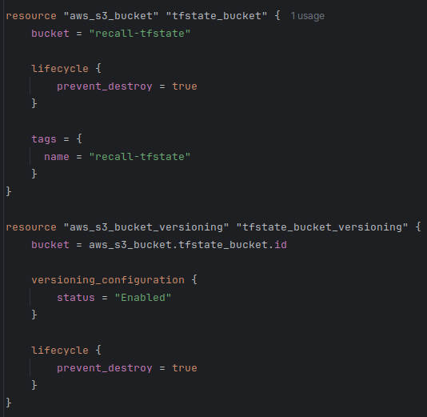
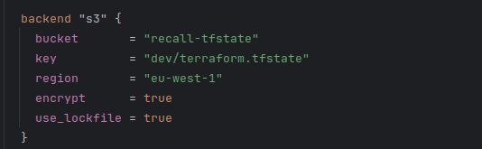
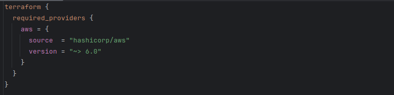
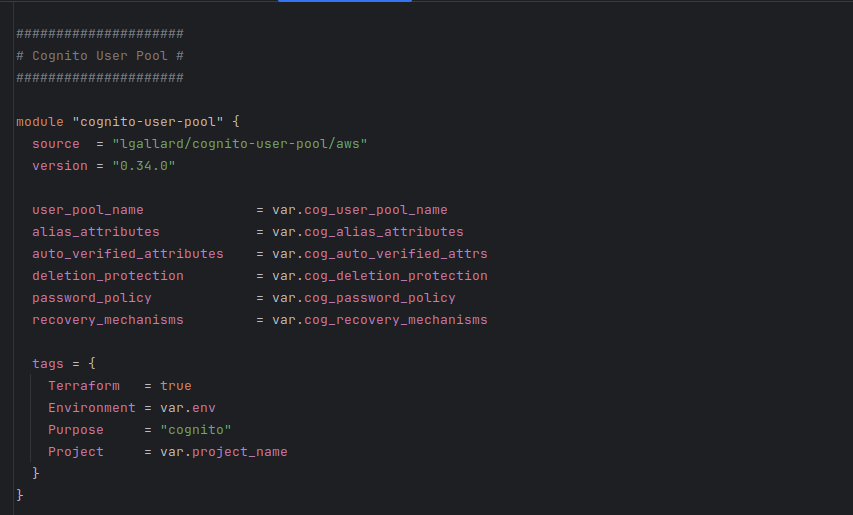
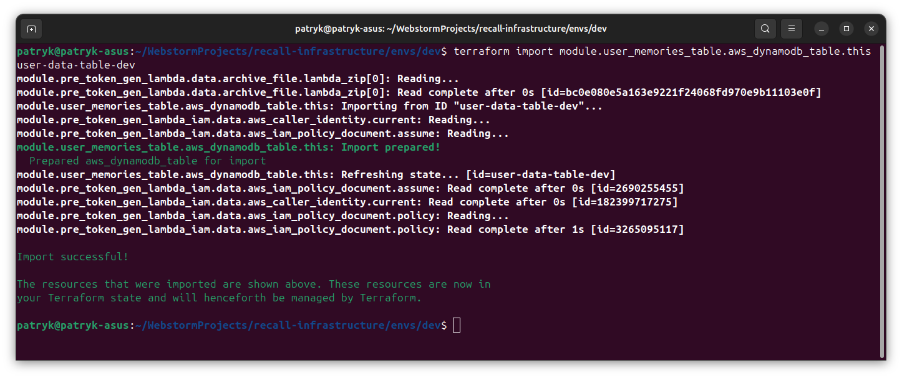
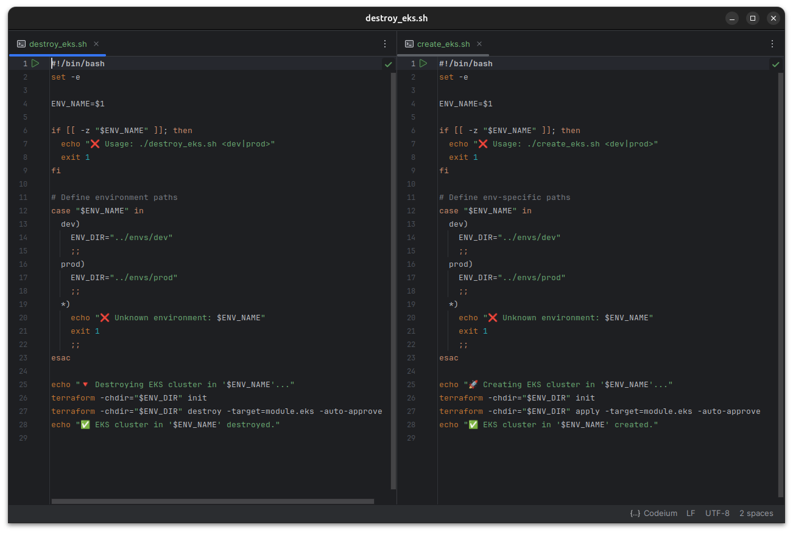
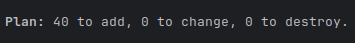
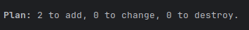
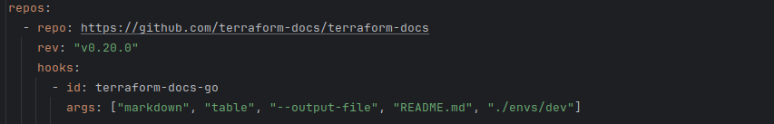
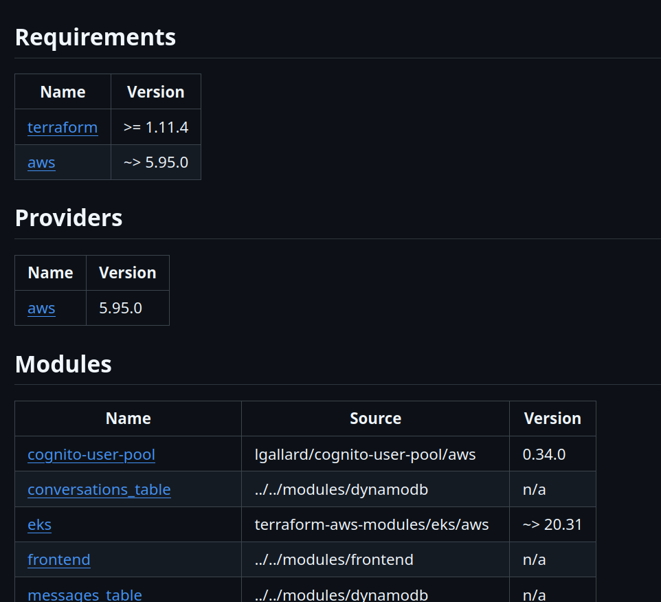

Welcome to my blog.

One of my [previous articles](https://blog.kug.la/recall-on-the-cloud/) gave an overview of Recall's AWS architecture. 
With the scale of the project, deploying Recall's infrastructure manually would be unhandy and bug-prone. It would also
deprive me of the many benefits of IaC that I discussed [here](https://blog.kug.la/terraform-introduction/).

Having passed the HashiCorp Terraform Associate exam earlier this year, I embarked on the task to create a strong 
Terraform foundation for Project Recall. While Recall was always deployed with Terraform, the original code was my 
first attempt at using IaC and, as such, did not take full benefit of all its powerful features.

# State Management in S3

Terraform heavily relies on the state file, `terraform.tfstate`, which contains details about the state of the
infrastructure. While the file can be stored locally, it is recommended to store it remotely for collaboration and
security. The standard way of doing so in AWS is storing it in an S3 bucket.

When bootstrapping, I set lifecycle.prevent_destroy to `true` when creating the bucket which holds the state. I also 
enabled versioning to be able to recover the state in case of any accidents, 
[as recommended by Hashicorp](https://developer.hashicorp.com/terraform/language/backend/s3).

S3 native state locking became generally available in Terraform v1.11, in November 2024. This means that we no longer
need to create a separate DynamoDB table to facilitate the locking mechanism. Enabling locking in Terraform
prevents two users from making simultaneous write operations to the state file, which could theoretically lead to state
corruption or race conditions.

Using a lockfile is now as simple as a single flag in the backend definition!

# Modules

> "As you manage your infrastructure with Terraform, you will create increasingly complex configurations. There is no intrinsic limit to the complexity of a single Terraform configuration file or directory."

While Terraform doesn't block us from having the entirety of our configuration in a single file, it gives us much
better tools for managing complexity. One of them is the use of modules.

Modules allow us to divide Terraform configuration into distinct logical components. This makes it easier to navigate,
understand, and update our configuration. Modules can also be re-used without the need to copy-and-paste duplicate code.
Modules also provide the extra benefit of encapsulation, meaning that, just like in object-oriented programming, an
arbitrary change in an unrelated part of the code should not have unintended consequences on the module.

Terraform makes it simple to write our own modules, and has a rich library of useful modules known as the [Terraform Registry](https://registry.terraform.io/).

Luckily for me, I already used a modular structure when I first designed the Terraform code for Recall. 
That meant that most modules didn't need any significant changes.

## Files in a module

One thing that I ensured across the board was a consistent structure. I wanted to make sure that a developer familiar
with one module would know where to find everything in other modules. Hence, I separated each module into a `main.tf`,
`outputs.tf`, and `variables.tf`, and `providers.tf`.

`main.tf` defines the data and resources of each module. For example, the dynamodb module contains the aws_dynamodb_table 
resource and all its definitions.

`outputs.tf` defines what the outputs of the module are. For example, the dynamodb_table name _(aws_dynamodb_table.this.name)_ or the dynamodb_table_arn _(aws_dynamodb_table.this.arn)_.

`variables.tf` defines the variables needed to set up an instance of the module. Below is an extract from the dynamodb module's variables file.

`providers.tf` defines the _required_providers_ for the module. Note that this is different from the _provider_ block, which configures the provider
and must not be a part of a module. `required_providers` merely declares that the module depends on this provider, with these sources and these version constraints.

## Reusability

Let's zoom in on one module: lambda.

To catch you up to speed, Lambda is AWS's serverless compute service, allowing us to run code without manually provisioning 
underlying infrastructure.

In the previous implementation, I hard-coded the path of the archive with the source code in the lambda module. This meant that I couldn't use
this module to deploy any other function, and any updates to the code were tedious.

To be reusable, my module needs to simply deploy any number of Lambda functions. Terraform expects the source code to be archived as `.zip`.

Following the example usage defined in the aws provider docs, I created an `archive_file` data snippet to archive the file from its directory.
This way, I don't need to go through the manual effort of archiving code with each change before I can deploy it.

As you can see, I also declared runtime, tags, variables, and anything that may differ, as variables instead of hard-coding them: to maximise
the module's reusability and assume only what's needed for the logic to function.

Furthermore, I simplified the variable names: `lambda_runtime`, for example, became just `runtime`. They remained fully descriptive, but without
being unnecessarily long (this is the lambda module; every developer will know it without it being mentioned in each variable here).

## What about remote modules?

Remote modules, and especially Terraform Registry modules, are a great tool that can speed up development and provide us with well-tested, 
production-ready building blocks.

I currently use a few remote module in my code: EKS, VPC, and [lgallard/terraform-aws-cognito-user-pool](https://github.com/lgallard/terraform-aws-cognito-user-pool),
for managing Cognito user pools. It allows me to keep the configuration minimal without having to design and maintain my own module.

While the Cognito module isn't published by AWS directly, it's widely adopted and actively maintained with the last commit less than a month ago, 
dozens of contributors, and over 1.5M downloads on Terraform Registry (the most of any Cognito module).

The Terraform Registry has modules for [DynamoDB tables](https://registry.terraform.io/modules/terraform-aws-modules/dynamodb-table/aws/latest),
[Lambda](https://registry.terraform.io/modules/terraform-aws-modules/lambda/aws/latest), and most other AWS resources too - so why not use those as well?

Quite often, those modules are optimised for generality. This means supporting dozens of optional features and
exposing a huge variable surface. This can make them harder to configure and reason about early on, as they
force us to confront design decisions that may not yet be relevant for the problem we're solving. With defining a local module, 
if I need to enable a new feature, I can just add it to the module and set an appropriate default value to ensure 
compatibility throughout all declarations.

Furthermore, remote modules frequently encode opinions: automatically assigning IAM policies, tags, and more. Local
modules give us full control over our code.

This being said though, Terraform Registry modules are still an extremely powerful tool that can reduce development time and
simplify configuration when used strategically.

## Importing existing resources

I already had existing DynamoDB tables with lots of data. It would have been demanding to create new tables and transfer the data over. 
Instead, I used Terraform CLI's `import` feature to link the existing, manually-created resources to my resources in the tfstate.

Previously, my infrastructure was a mixture of resources deployed by Terraform and resources created manually with the console.
I used `import` to standardise everything to be centrally managed by Terraform, making it simpler for me to update my resources and see
their current state.

# FinOps

I added a few simple scripts for creating and destroying the EKS resources. This is a bit of a FinOps exercise, as
running an EKS cluster is quite expensive ($73.00 USD a month), and with this script, I can very simply spin up and destroy 
this most expensive piece of infrastructure. Spinning up EKS takes a bit of time, but this is preferable to spending an extra 
$800 a year on the application, given that it doesn't currently need to be running 24/7.

I also added `count = var.eks_enabled ? 1 : 0` to my EKS declaration to make sure that the resource doesn't get
created each time I update my infrastructure. I currently set eks_enabled to false. This is something I wouldn't include in a 
production setup (for obvious reasons!) but that works well for me to minimise costs.

With eks_enabled set to false (all other resources are being added):

After setting it to true (only EKS resources are being added):

# Formatting, validation, documentation

Terraform has a great built-in tool: `terraform fmt`.

The command formats every `.tf` file in the directory, ensuring it matches the canonical format and style.

> "This command applies a subset of the Terraform language style conventions, along with other minor adjustments for readability."
 
Running the command with the `-recursive` flag in the root directory allowed me to very efficiently format all my code.

Terraform also has the `terraform validate` command, which verifies whether a configuration is syntactically valid and internally consistent.
I ran it as an additional check that my code is correct.

Lastly, I configured [pre-commit](https://pre-commit.com/) to use the [terraform-docs](https://github.com/terraform-docs/terraform-docs)
utility to automatically generate a complete README.md documentation, detailing all the requirements, providers, modules, resources and inputs I use. 

# Conclusion

This article went over some of the Terraform design decisions I've made after studying the language better. It's not
exhaustive (it would make for a very bland piece of writing if I detailed every single choice I've made!), but hopefully it
gives you an idea of how Recall is deployed and the thinking that went into designing the process - from keeping the tfstate
secure to managing costs.

If you have any questions about what was (or wasn't!) mentioned in the article, do feel free to message me on LinkedIn, and
I'll do my best to fill you in.

With this setup, adding new resources to Recall is a breeze and everything is accounted for, allowing me to maximise the pace
of development and keep costs low.

Thank you for reading.