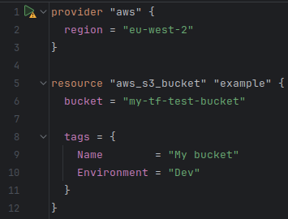

Welcome to my blog.

Arguably the simplest way to deploy resources on any Cloud is by using their online console.
With that, we can deploy our storage, compute, or networks with just a few clicks. 

This may be the right solution for a small project, where we don't need to manage complex cloud resources. Many years ago, 
I wanted to build an Internet of Things solution that would give me data about the environment in my house directly
on my phone. I bought an [Enviro sensor](https://learn.pimoroni.com/article/getting-started-with-enviro-plus) for monitoring
temperature, pressure, humidity and light level, and got it connected to my Raspberry Pi. It wasn't difficult to get a script
running that took a snapshot of the data every few seconds, but I needed to find a way to get that data off of my Raspberry Pi
and deliver it to my phone in real time.

It turns out that GCP's Firebase had the perfect solution for that -- and a simple one, too. I used Cloud Functions to
expose an HTTPS endpoint to receive data and verify its integrity. I then stored the data in Firestore 
(this is Firebase's NoSQL database).

It only took two resources to get my IoT project off the ground. Deploying something this simple using the online console
might not be optimal, but it's intuitive and just works.

# Is this always sufficient?

Now picture this: instead of two resources, you need to deploy 20, or 200. To make matters more complicated, many
of the resources tightly depend on each other: the compute instances need to be in the correct VPC and only certain
ones can have an internet gateway. We need numerous serverless scripts that have the identities to view different 
databases. On top of it, we have dozens of DBs that are vaguely similar, but may have minor but meaningful configuration
differences. And we need this environment replicated across dev, staging and prod.

I don't blame you if that paragraph gave you a headache! It's clear that this would be a nightmare to create (and an 
even greater terror to maintain...) using the console. So, what's our alternative?

# Issues with the console
Let's briefly rehash the problems we're facing deploying resources using the console:
1. **Manual effort doesn't scale**: updating dozens of similar resources by hand is very slow and tedious.
2. **Lack of repeatability**: recreating environments and keeping them in-sync is highly error-prone. Mistakes can be very expensive.
3. **No source of truth**: it's hard to determine what we have running and what we don't.
4. **Poor rollback capabilities**: if something breaks, it's difficult to go back to a state where everything worked fine.
5. **Difficult collaboration**: it's difficult to track what other engineers have done or are working on with the console.

Similar issues emerge in coding. There, the solution may be object-oriented programming and using version control software
like Git. It's clear that we need a similar solution for infrastructure management.

# Infrastructure as Code: a better way forward
Thankfully, there is a better way of deploying our infrastructure. By using IaC tools like Terraform, we can declare
our infra in code, just how we'd define a variable or a class in Python.

For example, the code above would create an S3 bucket named "my-tf-test-bucket" with the tags "My bucket" and "Dev"
in eu-west-2 (London).

We can use Terraform's in-built [variables](https://developer.hashicorp.com/terraform/language/values/variables) to add 
the environment tag dynamically, and [modules](https://developer.hashicorp.com/terraform/language/modules) to avoid
code repetition. This effectively solves problems #1 and #2.

On top of that, just as with any other code, we can commit this snippet into Git, allowing us to establish a 
"source of truth", keep track of changes, and roll back to this version later if necessary. This tackles problems #3,
#4, and #5.

Terraform can get quite complex too, and as with any code, it's important to keep it maintainable and adhere to the
best coding practices. I recently completed the HashiCorp Terraform Associate certification which taught me a lot about
what _good_ looks like in Terraform. I've been putting it into action and working on refactoring Project Recall's IaC
code to make it more secure, modular and cost-effective. This will be the focus of my next Terraform article, where
I will go over what I've learned and how I've implemented it.